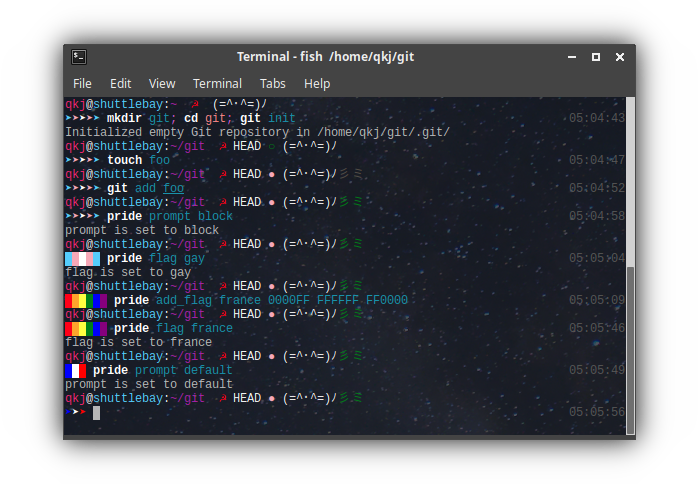

# Pride Cat

***DEV CHANNEL - OMF STOCK INSTALL NOT YET WORKING***
but you can totally try it out with most of the features. You just need to do a few things yourself. 

Install oh-my-fish, then install pride-cat with `omf install https://github.com/queenkjuul/omf-pride-cat`

then run

`cp $OMF_PATH/themes/pride-cat/pride_assets.fish ~/.config/fish/pride_assets.fish`
`cp $OMF_PATH/themes/pride-cat/pride_config.fish ~/.config/fish/pride_config.fish`
`fish $OMF_PATH/themes/pride-cat/functions/conf.d/__pride_init.fish`


These will be incorporated into the install functions once I figure out how omf handles them. 

==================

a highly customizable fish shell theme featuring cats and pride flags

[](https://github.com/oh-my-fish/oh-my-fish)
[](/LICENSE)




## Installation

#### Requirements
* [Fish shell](https://github.com/fish-shell/fish-shell) - a smart and user-friendly command line
shell for OS X, Linux, and the rest of the family
* [Oh My Fish](https://github.com/oh-my-fish/oh-my-fish) - The Fish shell Framework

Once Oh My Fish is installed:

    omf install https://github.com/queenkjuul/omf-pride-cat

This can be installed without Oh My Fish, you'll need to run `fish hooks/install.fish` first, then copy the function files to where they belong. 

### Configuration

pride-cat includes a configuration utility to easily tweak its appearance, located in `functions/pride.fish`

If you have the pride.fish file installed in `~/.config/fish/functions` (which it should be if you installed using oh-my-fish) then you can call the config script by simply invoking `pride`

`pride` follows the syntax `pride command value`

flag

```
pride flag default                 # default is trans. 
                                   # current options: 
                                   # trans
                                   # nonbinary
                                   # gay
                                   # bi
                                   # pan
                                   # lesbian
                                   # lipstick
                                   # soviet
                                   # sankara
```

Custom flags can be added. See the [Custom Flags](#custom-flags) documentation below. 

prompt

    pride prompt block                 # sets █
                                       # default  ➤
                                       # soviet flag overrides prompt setting

dirty commie

                                       
    pride commie off                   # default is on
                                       # turns off the hammer and sickle icon. 

username

    pride username off                 # default is on

hostname

    pride hostname off                 # default is on 
                                       # only displays if username is on

fish bind mode

    pride bind mode on                 # default is off

cat status

    pride cat_status on                # show always, default
    pride cat_status off               # show never
    pride cat_status git               # only in git repos
                                       # like og slavic-cat

cat icon

    pride cat_style slavic             # (^._.^)ﾉ
    pride cat_style default            # (=^･^=)ﾉ

reset config

    pride reset                        # sets all above options to defaults

Reset all theme variables to defaults

    pride_reset_defaults

## Custom Assets

Custom assets ("cats" [emoticons], emblems, prompt characters, and flags) can be easily added with the `pride` utility. 

    pride add_asset TYPE NAME 'VALUE' ['VALUES']...

for details see `pride add_asset help` or `assetfile.fish`

## More Customization

I've done my best to make it straightforward to tweak this even further, though I'm not totally sure what all would need to be tweaked. You can find any variable that you want to adjust and override it with `set -U` to whatever you want. It's even super simple to add variable switches to the `pride.fish` config script, as you can just add a new entry for the variable you want to swap, and a line for valid arguments that it takes. 

## Features

 * gaaaaayyyyyy
 * Current short version pwd
 * Display branch for Git projects
 * Git project dirty status indicator *meow* **(R,C,A,U,M,?)** *meow*
 * Fish shell vi mode indicator
 * Next line prompt
 * Two unicodes included!

## TODO

 * enable custom prompt characters besides just arrow and block
 * enable custom "cat" icons to allow for custom emoticons or emojis
 * allow customization of the "commie" character as well
 * allow customization of the prompt layout using `pride`


## Credits

[forked from Slavic Cat](https://github.com/yangwao/omf-theme-slavic-cat) which was in turn [forked from Toaster](https://github.com/oh-my-fish/theme-toaster)